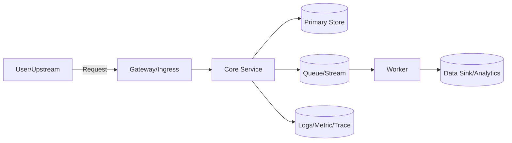
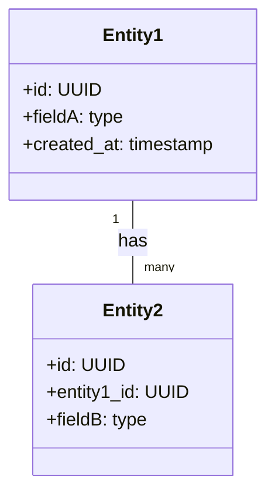

# Documentation Plan

This plan defines a docs-as-code approach for the project, including a plain-English overview, a senior-developer technical document, and a lightweight maintenance guide to keep both accurate over time. It also recommends using ADRs (Architecture Decision Records) for significant decisions and an optional PR checklist to enforce updates.

## Recommended Structure
- `docs/overview.md` — Plain-English overview (goal, current state, roadmap).
- `docs/technical/architecture.md` — Technical design/state/roadmap for senior devs.
- `docs/process/docs-maintenance.md` — How documentation is maintained and enforced.
- Optional: `docs/adrs/` — ADRs; add as decisions are made.
- Optional: `.github/PULL_REQUEST_TEMPLATE.md` — Checklist to enforce doc updates.

The existing root-level `README.md` stays the public entry point (quick start, repo orientation). The new `docs/` tree supplements it with deeper audience-specific material rather than replacing it.

---

## Document 1 — Project Overview (Plain English)
Proposed path: `docs/overview.md`

Title: Project Overview

1) What This Is (in one minute)
- Elevator pitch: TODO: <1–2 sentences explaining the project in plain language>
- Who it’s for: TODO: <primary users/stakeholders>
- Problem we solve: TODO: <the pain and why it matters>
- What success looks like: TODO: <measurable outcome, e.g., time saved, errors reduced>

2) What Exists Today (Current State)
- Codebase status: TODO: <key components in repo, health, test coverage rough %>
- What works now: TODO: <features or flows currently usable>
- What’s not included yet: TODO: <not-in-scope items>
- Known gaps/risks: TODO: <top 3 risks or uncertainties>

3) How It Works (High Level)
- Inputs: TODO: <data sources, user input, upstream systems>
- What we do: TODO: <key steps in simple terms>
- Outputs: TODO: <artifacts, UI, API responses, files, notifications>
- Data privacy/handling: TODO: <plain-language statement on data handling>

4) Why This Approach
- Focused scope first to reduce risk; expand later.
- Standard tooling and open formats to avoid lock-in.
- Decoupled components for parallel work and replaceability.
- Clear interfaces and logs for diagnosability.

5) What’s Coming Next (Roadmap)
- Now (0–4 weeks): TODO: <near-term milestones>
- Next (1–2 months): TODO: <milestones>
- Later (3+ months): TODO: <ambition, stretch goals>
- Decision checkpoints: TODO: <when we’ll reassess scope/approach>

6) How to Try It
- Prereqs: TODO: <tools, versions>
- Quick start: TODO: <two or three commands to run or open>
- How to provide feedback: TODO: <Slack/Jira/Issue link>

7) Glossary
- TODO: <terms users will see in UI/docs and what they mean>

---

## Document 2 — Technical Design, State, and Roadmap (Senior Dev)
Proposed path: `docs/technical/architecture.md`

Title: Technical Design, State, and Roadmap

1) Context, Goals, Non‑Goals
- Context: TODO: <business/technical background>
- Goals: TODO: <S.M.A.R.T. goals or acceptance criteria>
- Non-goals: TODO: <explicitly out-of-scope items>
- Assumptions: TODO: <external SLAs, team capacity, budget, compliance>

2) Requirements
- Functional: TODO: <bullet list of “shall” statements>
- Non-functional: TODO: <availability, latency, throughput, durability, cost, privacy, accessibility>
- Compliance/security: TODO: <PII/PHI, encryption at rest/in transit, authN/Z>

3) Architecture Overview
- Components and boundaries:
  - TODO: <Component A> — responsibility, inputs/outputs, dependencies
  - TODO: <Component B> — responsibility, inputs/outputs, dependencies
- Diagram (replace placeholders as you implement):



4) Data Model and Contracts
- Domain entities: TODO: <Entity1, Entity2, relations>
- Persistence: TODO: <DB/Storage choice, sharding/partitioning if any, migrations>
- Schemas:



- External APIs: TODO: <endpoints with method, path, input/output, error semantics>
- Versioning strategy: TODO: <backward compat, deprecations>

5) Control Flows (Key Paths)
- Create/update flow: TODO: <step-by-step + sequence diagram if helpful>
- Error/Retry semantics: TODO: <idempotency keys, retry backoff, dead-letter>
- Background jobs: TODO: <scheduling, concurrency, visibility>

6) Operational Concerns
- Build: TODO: <tooling, reproducibility, cache>
- Deploy: TODO: <envs, IaC, rollout/rollback, feature flags>
- Config/secrets: TODO: <how/where, rotation, separation per env>
- Observability: logs, metrics, traces; TODO: <what’s captured; SLOs/alerts>
- Security: TODO: <threat model highlights, least privilege, input validation>
- Backups/DR: TODO: <RPO/RTO, tested restore process>

7) Performance & Scalability
- Expected load: TODO: <QPS, payload sizes, peak patterns>
- Bottlenecks: TODO: <hot paths, DB constraints>
- Benchmarks: TODO: <tools, fixtures, targets>
- Capacity plan: TODO: <scale-up/out triggers, cost guardrails>

8) Testing Strategy
- Unit: TODO: <coverage targets, areas to prioritize>
- Integration/Contract: TODO: <test doubles vs. real deps>
- E2E/Smoke: TODO: <what must never regress>
- Non-functional: TODO: <perf, chaos, security scans>
- Test data: TODO: <factories, anonymized fixtures>

9) Risks and Mitigations
- TODO: <Top 5 risks with mitigation/owner/state>

10) Alternatives Considered (ADRs)
- ADRs live under `docs/adrs/`.
- Example index (add as they are written):
  - 0001: Adopt docs-as-code, ADRs, PR checks — Status: Proposed/Accepted
  - 0002: Choose <DB/Queue> — Status: TBD

11) Current State (Living Status)
- Completed: TODO: <committed features/components>
- In progress: TODO: <branches/PRs, owners, ETA>
- Blockers: TODO: <what, why, path to unblock>

12) Roadmap
- Milestones with dates/owners:
  - M1: TODO: <feature> — Owner: — Date:
  - M2: TODO:
- Dependencies: TODO: <teams/systems>

13) Open Questions
- TODO: <decision points, unknowns, experiments>

14) Runbook (Ops)
- Startup commands: TODO: <`docker compose up --build` for prod, `npm run dev` / `npx prisma dev` for local>
- Health checks: TODO: <`curl http://localhost:3000/api/health` plus DB connectivity checks>
- Evidence-based verification: TODO: <record required `npm run type-check`, `npm test`, targeted scripts>
- Logs & diagnostics: TODO: <where to tail app/DB logs, enable verbose output>
- Common failures and fixes: TODO: <top 3 errors, mitigation steps>
- On-call notes: TODO: <escalation path, contact info>

---

## Document 3 — Documentation Maintenance Guide
Proposed path: `docs/process/docs-maintenance.md`

Title: Documentation Maintenance Guide

1) Purpose and Scope
- Keep docs accurate, discoverable, and reviewable alongside code.
- Define what to update, when, and who approves.

2) Ownership
- Doc owner: TODO: <name/role>
- Technical approver(s): TODO: <names/roles>
- Backup owner: TODO:
- Authority: Owners can block merges that break docs.

3) Where Things Live (Source of Truth)
- `docs/overview.md` — Non-technical overview.
- `docs/technical/architecture.md` — Technical design/state.
- `docs/adrs/` — One ADR per decision; sequential IDs.
- `docs/diagrams/` — Mermaid/PlantUML source files.
- `.github/PULL_REQUEST_TEMPLATE.md` — Doc checklist (optional).

4) Update Triggers (When to Change Docs)
- Any API, schema, config, or behavior change user-visible or system-sensitive.
- New feature, new dependency, or new environment variable.
- Added/retired component or data store.
- Performance/SLO/SLA/Cost changes.
- Security fixes or new threat considerations.
- At release cut or monthly maintenance review (whichever comes first).

5) Process (How to Update)
- Change the code → update related docs in the same PR.
- If making or reversing a decision, add/update an ADR:
  - Place in `docs/adrs/NNNN-title.md`.
  - Link ADR in `docs/technical/architecture.md` under “Alternatives Considered”.
- Keep diagrams as code (Mermaid). Update source under `docs/diagrams/` and embed.
- Reviewers must verify:
  - Changed areas are reflected in docs.
  - Version bumps and migrations are documented.
  - New risks/assumptions captured.
- Evidence-based documentation protocol:
  - Contextual evidence: cite files/lines or ADRs that motivated the change.
  - Type evidence: include TypeScript outputs (`npm run type-check`) that prove contracts hold.
  - Execution evidence: capture command output/screens or automated test runs (`npm test`, `tsx scripts/...`).

6) Versioning and Releases
- Tag releases; at each tag:
  - Snapshot current state in “Current State” sections.
  - Update `CHANGELOG.md` (optional).
  - Note ADRs accepted since last release.
- Keep docs on `main` reflecting the latest code; avoid per-branch doc divergence.

7) Quality Bar (Checklist for PRs)
- Overview affected? If yes, updated `docs/overview.md`.
- Technical behavior affected? Updated `docs/technical/architecture.md`.
- New/changed decision? Added ADR with context, options, trade-offs, decision, status.
- Diagrams updated? Yes/No/N/A.
- Migration steps documented? Yes/No/N/A.
- Security/PII implications reviewed? Yes/No/N/A.
- Tests updated? Yes/No/N/A.

8) ADR Template (copy into `docs/adrs/0000-template.md`)
- Title: NNNN-<short-title>
- Status: Proposed | Accepted | Superseded by NNNN | Rejected
- Context: <why we’re deciding; constraints>
- Options: <option A, B, C>
- Decision: <chosen option, rationale>
- Consequences: <positive/negative, follow-ups>
- References: <links, issues, PRs>

9) Tooling (Optional, nice-to-have)
- Style checks: Vale or markdownlint to maintain clarity.
- Link checkers to avoid broken references.
- Mermaid preview in IDE/CI.
- CODEOWNERS for docs paths to require reviewers.

10) Cadence
- Monthly doc review session to pay doc-debt.
- Quarterly architecture review to retire stale ADRs and re-affirm assumptions.

---

## What I Recommend (re: this approach)
- Docs-as-code in `docs/` with owners and checklists.
- ADRs for decisions (keep the technical doc readable; push details to ADRs).
- A small PR template so updates happen as part of normal work.
- If more rigor later: add Vale/markdownlint and a monthly doc-review calendar invite.

## Proposed File Destinations
- `docs/overview.md`
- `docs/technical/architecture.md`
- `docs/process/docs-maintenance.md`
- Optional: `docs/adrs/0000-template.md`

## PR Template Draft (to drop into `.github/PULL_REQUEST_TEMPLATE.md`)
```
## Summary
- [ ] Linked issue / ADR: <!-- e.g., #123 or ADR-0003 -->
- [ ] Contextual evidence: <!-- reference files/lines or screenshots -->
- [ ] Type evidence: `npm run type-check` (result: )
- [ ] Execution evidence: `npm test` / `tsx …` (result: )

## Documentation Checklist
- [ ] `docs/overview.md` updated (user-facing impact)
- [ ] `docs/technical/architecture.md` updated (system or API changes)
- [ ] ADR added/updated (new decision)
- [ ] Runbook section touched if ops behavior changed
- [ ] Diagrams updated (or N/A noted)
- [ ] Security/PII implications reviewed

## Testing
- [ ] Unit / integration tests added or updated
- [ ] Manual QA notes (if applicable)
```

## Questions to Personalize These Quickly
- Project name and 1–2 sentence elevator pitch?
- Primary users and the top problems we solve?
- Current components (names) and what works today?
- Tech stack choices already made or preferred?
- Near-term 3 milestones with rough dates?
- Any compliance or data-classification constraints?

## Next Steps
1) Confirm this structure and I’ll scaffold the files under `docs/`.
2) Provide answers to the “Questions” so I can fill TODOs.
3) Optionally add a PR template and ADR 0001 to adopt docs-as-code.
