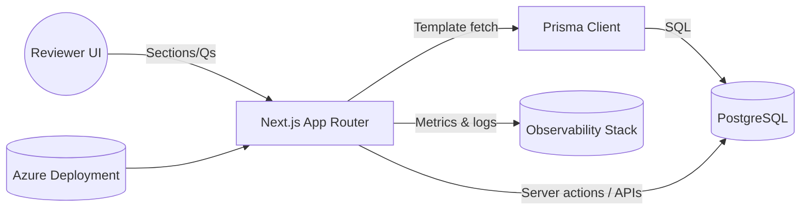

# Technical Design, State, and Roadmap

## 1. Context, Goals, and Non-Goals
- **Context:** Tech Triage Platform modernizes CCHMC Innovation Ventures’ technology evaluation workflow using a database-driven Next.js application deployed in containers.
- **Goals:**
  - Deliver a dynamic form engine that renders the full triage questionnaire from database templates.
  - Guarantee draft persistence and auditable submissions with calculated scoring outputs.
  - Provide a secure, Azure-ready deployment path with observability and secrets hygiene.
  - Maintain evidence-based engineering (type + test proof) for every change.
- **Non-goals (for now):** Multi-tenant SaaS, public self-service submission portal, static form maintenance. *(Confirm/add others.)*
- **Assumptions:** Reviewers authenticate via institutional SSO (planned), submissions contain PHI/PII requiring HIPAA safeguards, team operates with limited ops support requiring automation. *(Add budget/compliance constraints if any.)*

## 2. Requirements
- **Functional:**
  - Render triage sections, including repeatable competitor/SME tables, from database templates.
  - Allow draft save/resume and final submission with calculated impact/value scores.
  - Enforce validation rules before advancing sections or submitting.
  - Expose submission data for internal analytics/export workflows.
- **Non-functional:**
  - Draft recovery rate ≥95%, interaction latency <500 ms, zero unintentional data loss.
  - Audit trail for submissions (timestamps, user IDs).
  - Availability target *(TBD – add SLO once defined)*.
  - HIPAA-aligned handling: TLS in transit, encrypted secrets, least-privilege DB roles.
- **Compliance/Security:** HIPAA, internal CCHMC security policies, secret rotation before go-live. *(Add SOC2/PIA requirements if relevant.)*

## 3. Architecture Overview
- **Next.js Application (App Router):** Renders dynamic form UI, server actions/API routes, handles validation and scoring orchestration.
- **Form Template Store (PostgreSQL via Prisma):** Persists form templates, sections, questions, options, and decision logic plus submissions and calculated scores.
- **Form Engine Library:** Shared TypeScript modules under `src/lib/form-engine/` for state, renderers, conditional logic, validation, and repeatable group handling.
- **Deployment Surface:** Docker multi-stage build, optionally orchestrated via Docker Compose locally; target Azure Container Apps/ACI with managed Postgres.

## 4. Data Model and Contracts
- **Core entities:** `FormTemplate`, `FormSection`, `FormQuestion`, `QuestionOption`, `FormSubmission`, `QuestionResponse`, `CalculatedScore` (`prisma/schema.prisma`).
- **Relationships:** Templates own ordered sections; sections own ordered questions; questions may include scoring config, conditional logic JSON, and option sets; submissions reference template version and include responses + scores.
- **API contracts:** `/api/form-templates` returns active template; planned `/api/submissions` endpoints for create/update/fetch drafts and finals. *(Document payload schemas once finalized.)*
- **Versioning:** Template versions tracked via `FormTemplate.version`; ADRs will record major schema/contract changes. *(Add compatibility strategy for migrated submissions.)*

## 5. Key Control Flows
1. **Form rendering:** Page load → fetch active template → initialize `FormEngineProvider` with template + initial data → render `DynamicFormRenderer` and adapters.
2. **Draft persistence (planned):** Local state updates trigger auto-save → server action/API writes `FormSubmission` with status `DRAFT` → repeatable groups and responses serialized via `QuestionResponse` JSON.
3. **Submission:** Validation pass → calculate scores via scoring engine → persist final submission (status `SUBMITTED`) → emit audit/timestamp.
4. **Error handling:** Section-level error boundaries (planned) capture render issues, provide recovery UI, and log to monitoring channel.

## 6. Operational Concerns
- **Build:** `next build --turbopack`; Docker multi-stage image bundles Next.js server and Prisma artifacts.
- **Deploy:** Current path uses Docker Compose locally; target Azure Container Apps or Container Instances + managed Postgres. CI/CD pipeline (GitHub Actions) pending.
- **Config/Secrets:** Local via `.env`; production to migrate to Azure Key Vault/Container Apps secrets; separate migrator/app DB roles already modeled.
- **Observability:** TODO – enable Azure Monitor / Container Insights, structured application logging, and runtime metrics.
- **Security:** Enforce HTTPS termination, rotate credentials, integrate NextAuth for authZ/authN, validate all API inputs with Zod.
- **Backups/DR:** TODO – define backup cadence for managed Postgres, recovery point/time objectives.

## 7. Performance & Scalability
- **Current load expectation:** *(Add reviewer counts, submissions/month, concurrency projections.)*
- **Hot spots:** Dynamic renderer re-renders, repeatable group diffing, server actions. Planned optimizations include memoized adapters, pagination/virtualization, and debounced validation.
- **Benchmarks:** Pending once full question set lands; set targets for initial load, section navigation, and auto-save operations.
- **Capacity plan:** Scale Azure app instance; adjust Postgres tier/reserved compute as submission volume grows. *(Document triggers.)*

## 8. Testing Strategy
- **Unit:** Validation (`src/lib/form-engine/validation.ts`), scoring calculations, conditional logic helpers.
- **Integration:** API endpoints for submissions/templates, Prisma data access, auto-save pipeline.
- **E2E/Smoke:** Full dynamic form completion, draft resume, error recovery flows. Playwright suite to be expanded.
- **Non-functional:** Performance smoke tests (interaction latency) and security linting once auth added.
- **Test data:** Seeder populates canonical template and demo submissions; synthetic dataset generator available under `scripts/`.

## 9. Risks and Mitigations
- **Secrets exposure & rotation gap:** Mitigate by adopting Key Vault/Container Apps secrets and removing plaintext secrets from deployment configs.
- **Incomplete persistence path:** Prioritize building submission APIs and auto-save to avoid data loss.
- **Validation gaps:** Finish Zod wiring and enforce checks before navigation/submission.
- **Monitoring absent:** Instrument logging/metrics early to detect runtime failures.
- **Deployment rollback plan missing:** *(Document desired strategy – e.g., blue/green, container rollback.)*

## 10. Alternatives and Decisions
- **ADRs:** Store under `docs/adrs/NNNN-title.md`. Planned topics:
  - ADR-0001: Adopt docs-as-code with evidence-based workflow.
  - ADR-0002: Choose Azure managed Postgres over self-hosted.
  - ADR-0003: Select NextAuth (or alternative) for authentication.
  - ADR-0004: Persistence strategy for repeatable groups (JSON vs relational tables).
  - ADR-0005: Score calculation engine design.

## 11. Current State (Living)
- **Completed:** Template loader, renderer scaffold, conditional logic, baseline repeatable groups, Docker pipeline, Azure image publish, seed tooling, type/lint/test configuration (with known failing tests).
- **In progress:** Draft persistence APIs, validation UX, question set expansion, repeatable group UX polish, monitoring/observability.
- **Blockers:** Decision on Azure DB hosting; adoption of secrets management; fixing 5 failing Jest tests; finalizing auth approach.

## 12. Roadmap
- **Milestone 1:** Dynamic form parity with legacy sheet (owner TBD, target date TBD).
- **Milestone 2:** Secure, monitored Azure deployment with auth (owner TBD, target date TBD).
- **Milestone 3:** Reporting/export delivery (owner TBD, target date TBD).
- **Dependencies:** Innovation Ventures content input for question expansion; infra team for Azure networking; security review for HIPAA compliance. *(Fill owners/dates.)*

## 13. Open Questions
- What are the submission retention requirements and archival process?
- Which analytics/export surfaces need integration first?
- What reviewer concurrency and SLA targets must we guarantee?
- How will access control be segmented (reviewer vs admin roles)?

## 14. Runbook (Ops)
- **Startup commands:**
  - Local dev: `npm run dev` (app) + `npx prisma dev` (managed Postgres).
  - Local Docker: `docker compose up --build` (app + Postgres, migrations via `scripts/start.sh`).
  - Azure: *(Document container app commands once finalized.)*
- **Health checks:** `curl http://localhost:3000/api/health`; confirm database connectivity; monitor Azure health probe once deployed.
- **Evidence-based verification:** `npm run type-check`, `npm test`, targeted scripts (`npx tsx scripts/verify-demo-data.ts`) recorded in PR template.
- **Logs & diagnostics:**
  - Local: `docker compose logs -f app database`; Next.js server console.
  - Planned Azure: Container Apps log streaming + Log Analytics workspace. *(Add instructions.)*
- **Common failures & fixes:**
  - Prisma dev server port conflicts → `lsof -ti:51213 | xargs kill`.
  - Docker Postgres volume reset → ensure Azure DB configured, avoid sandbox URLs.
  - Seed mismatch → rerun `npm run db:seed` with correct `SEED_DEMO_DATA` flag.
- **On-call notes:** *(Define escalation contacts, paging channel, and fallback procedures.)*

---

*Update this document alongside major architectural changes, ADRs, or release milestones. Use PR template evidence fields to prove updates were verified.*
